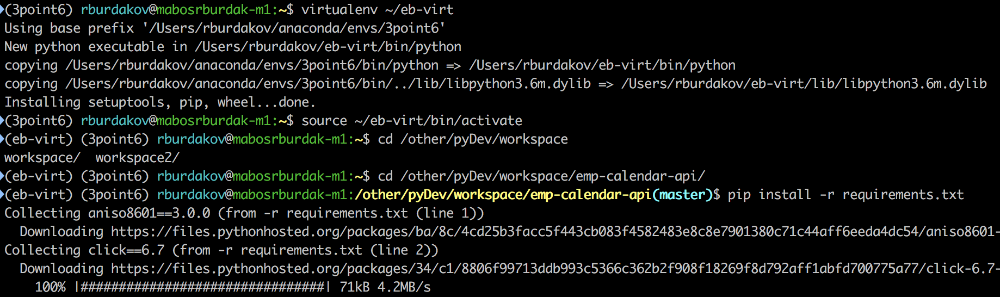
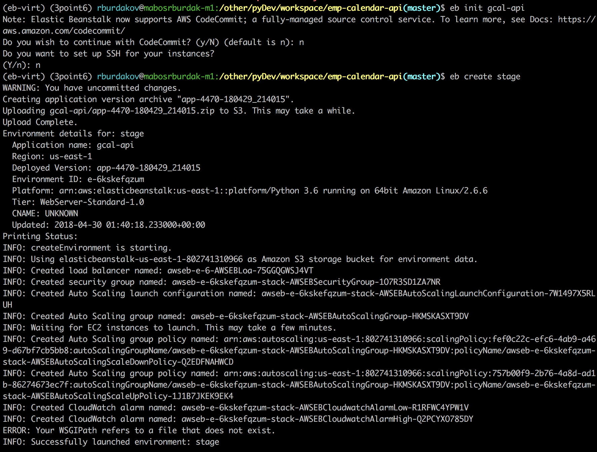
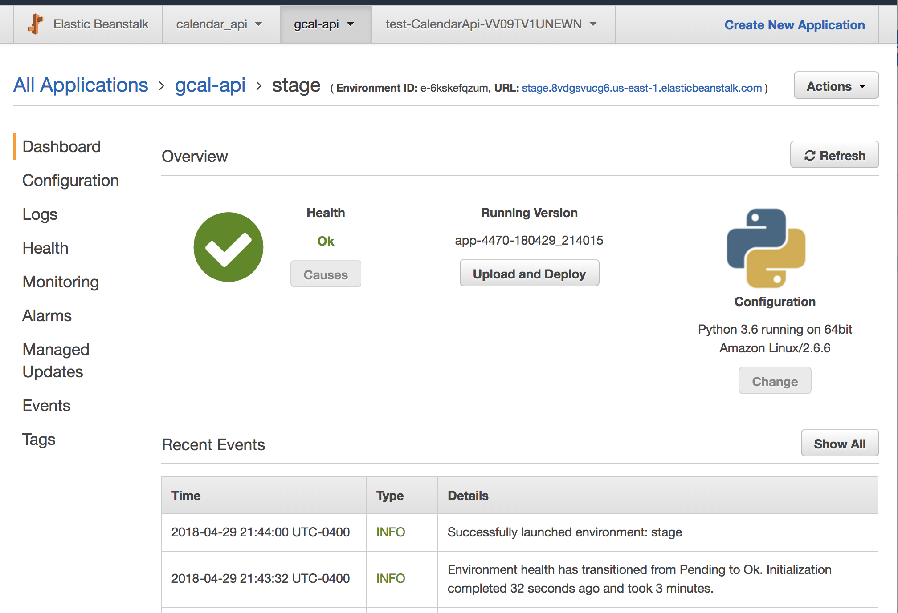

# EMP Calendar API

Flask REST service to proxy calls to google calendar. Due to limitations of AWS lambda service to make grpc calls to get authorized against Google API, corresponding functionality was pulled out to separate service.

## Getting Started

These instructions will get you a copy of the Calendar API service up and running on your own AWS account for development and testing purposes. See deployment for notes on how to deploy the project on a live system.

### Prerequisites

## Local development environment

* Python 3
* pip
* virtualenv
* Active AWS Account to deploy service
* Google account that will be used for creating calendars. *NB:* Only 188 calendars can be created per google account.
* [AWS CLI](https://aws.amazon.com/cli/) AWS Command Line Interface that simplifies operations with Elastic Beanstalk (deploy, logs, etc)

## Obtaining *google_creds.json* file

`google_creds.json` is a file that contains access token and other details that are necessary to execute calls to Google Calendar API. For security reasons, this file isn't uploaded in this repo. 

In order to get google credentials json file you will need to follow instruction from [Google Drive API](https://developers.google.com/drive/v3/web/quickstart/python). 
Once you successfully run through steps, authorization information will be stored on the file system, 
so subsequent executions will not prompt for authorization. You will need to locate `client_secret.json` file and 
copy as `google_creds.json` into this repository local copy. On OSX file can be found in `~/.credentials/` folder

*NB* You can't move forward without valid `google_creds.json` file next to `application.py` file.

### Installation/Deployment

There are 2 ways to install/deploy Calendar API. 

1. Package calendar api and deploy with cloud formation template. 
[Steps](https://github.com/roman-burdakov/emp-aws-stack-cf) to deploy distribution
2. Use [AWS CLI EB](https://docs.aws.amazon.com/elasticbeanstalk/latest/dg/eb-cli3.html) 
to source code from command line

## Package distribution for CF setup

1. Create virtual environment: `virtualenv ~/eb-virt`
2. Activate it: `source ~/eb-virt/bin/activate`
3. Install dependencies in order to run application locally `pip install -r requirements.txt` . 

4. Run locally as `python application.py`
5. When ready to deploy your changes, simply archive working directory `zip -r calendar_api.zip . -x *.git*`
6. Upload archive to S3 and follow steps [to provision stack](https://github.com/roman-burdakov/emp-aws-stack-cf) from Cloud Formation Template.

## Use AWS CLI to deploy Calendar API to Cloud

1. Follow [steps](https://docs.aws.amazon.com/elasticbeanstalk/latest/dg/eb-cli3-install.html) to install AWS CLI.
2. Initialize new Elastic Beanstalk application. I.e. `eb init gcal-api`, where `gcal-api` is an app name.
Answer `Do you wish to continue with CodeCommit?` and 
`Do you want to set up SSH for your instances?` can be answered as no unless you need them.
3. Create environment `eb create stage` where `stage` is an environment name.
4. Once complete, call `eb open` to open url in browser. You can plugin this host into `config/dev.env.js` for [client side](https://github.com/noorzaman/emp)

For either of two cases, you should be able to manage your application/configuration through *AWS CLI* or 
AWS Web Console. Just simply navigate to `Elastic Beanstalk` service and open application details page:

## Built With

* [AWS Elastic Beanstalk](https://aws.amazon.com/elasticbeanstalk/)
* [Flask RESTful](https://flask-restful.readthedocs.io/en/latest/) - lightweight python web framework 
* [AWS Command Line Interface](https://aws.amazon.com/cli/)

## Contributing

Free to use and distribute. Use it at your own risk and additional charges might apply to your account for using AWS Services.

## Acknowledgments

* Inspired by Angelo Morello for Enhanced Meeting Planner project
